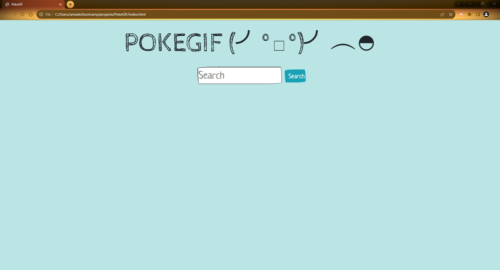

# pokeGIF

## Description
Our webpage has been built from the ground the up, combining two existing API (Giphy & Poke),
to bring forth useful data and pokemon gifs to the user on one convient platform. The purpose of
our webpage is to have users quick search their interested pokemon, and have the base stats of
them pop up in an instant to have ready for usage, and following along with it an assortment of
related gifs to enjoy and share. The search feature has been designed to speed track the most asked

information about a pokemon's attributes, it's base stats. Users will be engaged in continous searches
back to back with relevant, useful, and enjoyable data on every search, covering various pokemon they
wish to search without scrolling and passing through tedious pages. In all-in-one utility for every
pokemon fan of any knowledge experience. __Technology__ used is bootswatch CSS framework, theme
sketchy. The pokemon stats were pulled using Poke API and the gifs related to the pokemon were
generated using giphy API. 

information about a pokemon's attributes, it's base stats. Users will be engaged in continous searchs
back to back with relevant, useful, and enjoyable data on every search, covering various pokemon they
wish to search without scrolling and passing through tedious pages. In all-in-one utility for every
pokemon fan of any knowledge experience.

## Usage
Users will input in the search box the name of the pokemon they wish to look up, and then click the 
search button. The base stats will appear first on info cards denoting the stat name and stat number 
i.e( Attack - 125). Follwing the info cards there will be an assortment of gifs related to the pokemon
searched.

[Live URL](https://eguerreroxx.github.io/PokeGIF/)

## Screenshot

